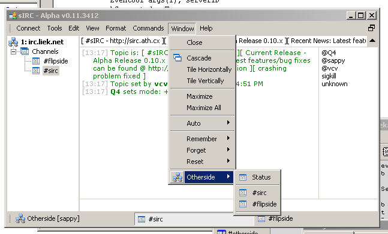



## sIRC \- IRC Client

### Description

My second attempt at an IRC Client. I have started to recode it in C++, so decided to make the VB source available. It doesn't have DCC yet, or many options, but it does include my scripting language (SEX). This code is only to be used for learning and for reference purposes. You may NOT continue working on this version and call it your own. You may NOT rename it and call it yours. If you wish to use it somehow, you must email me first. I will be active in making sure people don't abuse the code. Enjoy.
 
### More Info
 

             |
---                |---
**Submitted On**   |2002-03-02 21:42:12
**By**             |[vcv](https://github.com/Planet-Source-Code/PSCIndex/blob/master/ByAuthor/vcv.md)
**Level**          |Advanced
**User Rating**    |5.0 (15 globes from 3 users)
**Compatibility**  |VB 6\.0
**Category**       |[Complete Applications](https://github.com/Planet-Source-Code/PSCIndex/blob/master/ByCategory/complete-applications__1-27.md)
**World**          |[Visual Basic](https://github.com/Planet-Source-Code/PSCIndex/blob/master/ByWorld/visual-basic.md)
**Archive File**   |[sIRC\_\-\_IRC610243102002\.zip](https://github.com/Planet-Source-Code/vcv-sirc-irc-client__1-32554/archive/master.zip)

